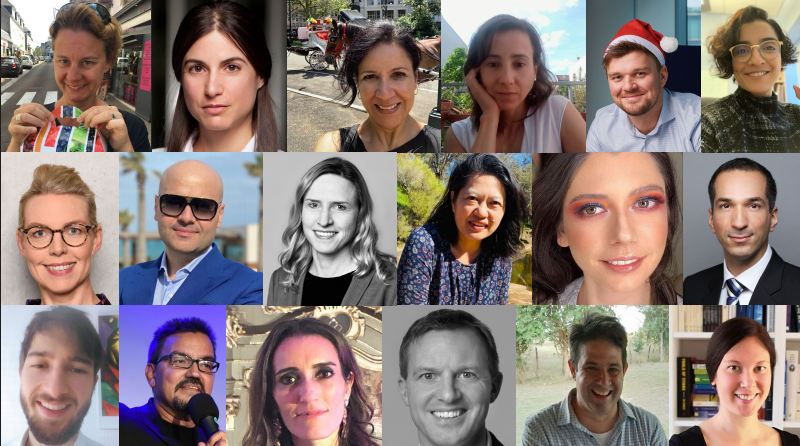
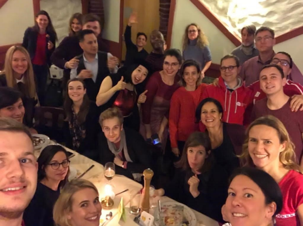

# Welcome to AcceleRED
### Together We Can

## History
On December 2019,people from different backgrounds of the Berlin Ecosystem, all dressed in Red, gathered to celebrate Christmass and decided to start a Business.

## Events
### **MoreScience4Berlin**
Berlin used to generate and nurture Noble Prize Winner and fantastic Scientific Entrepreneurs. Cities around the world flourished impulsing Scientific Startups. Meanwhile, Berlin was becoming laggard on this trend. In 2020, Henry XXX a scientifc from Bayer, shared his dream with many others building an initiative that aims to transform the city and impulse the scientific population to thrive on the Startup Arena.
### 4CEOs
- **Bayer:** *Stefan Oelrich*
- **Campus Berlin Buch:** *Christina Quensel*
- **Pfizer:** *Peter Albiez*
- **Sanofi:** *Fabrizio Guidi*
### Our friends and most valuable supporters:
- Ada Health
- Aldlershof
- Berlin Partner
- biotx.ai
- Freie Universität Berlin
- Hacking Health
- German Accelator
- MIT

## Hackathons
1. MIT Beat the Pandemic I
2. MIT Beat the Pandemic II
3. MIT LatAm vs COVID19
4. HackDuke: Duke University
5. YHack: Yale University
6. HackUMass: University of Massachusetts Amherst

## Projects

Syntax highlighted code block

- Bulleted
- List

1. Numbered
2. List

**Bold** and _Italic_ and `Code` text

[Link](url) and .png)

For more details see [GitHub Flavored Markdown](https://guides.github.com/features/mastering-markdown/).

### Jekyll Themes

Your Pages site will use the layout and styles from the Jekyll theme you have selected in your [repository settings](https://github.com/YoSoyMayonesa/YoSoyMayonesa.github.io/settings). The name of this theme is saved in the Jekyll `_config.yml` configuration file.

### Support or Contact

Having trouble with Pages? Check out our [documentation](https://docs.github.com/categories/github-pages-basics/) or [contact support](https://github.com/contact) and we’ll help you sort it out.
